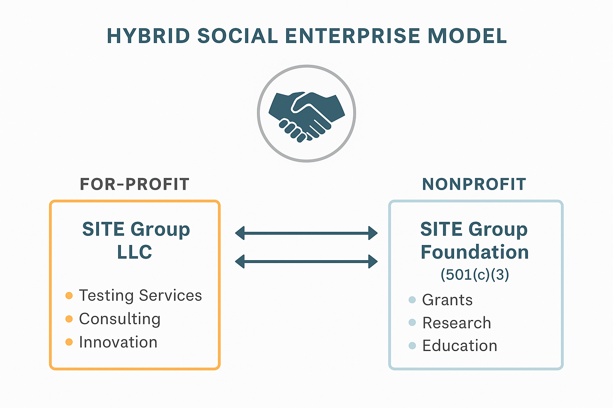

# Business Plan: a Dual-Structure Model
 The dual-structure model (LLC + Nonprofit) is a smart, flexible solution for mission-driven businesses that want to:
- Operate a for-profit business (e.g., testing, consulting, product evaluation)
- Access grants, donations, and foundation funding through a nonprofit arm
- Keep clear financial and legal boundaries between mission work and revenue-driven services

 What Is a Dual-Structure Model?
- A dual-structure involves:
- A for-profit entity (e.g., LLC, Benefit Corp) → handles revenue-generating activities
- A nonprofit organization (501(c)(3)) → handles mission-driven, public benefit activities

 They may:
- Share founders, staff, branding, or office space
- Contract services with each other
- Collaborate on joint projects
  
### 🔁 How They Work Together

| Function                        | LLC Role                                  | Nonprofit Role                                   |
|--------------------------------|--------------------------------------------|--------------------------------------------------|
| **Grants & donations**         | ❌ Not eligible                             | ✅ Can receive grants, tax-deductible donations   |
| **Testing services**           | ✅ Performs testing, billing clients        | 🔁 May subcontract LLC for technical services     |
| **Outreach / education**       | ⚠️ Possible but limited                     | ✅ Primary responsibility                         |
| **Public benefit research**    | ⚠️ Sometimes funded via contracts           | ✅ Eligible for NIOSH, CDC, foundation funding     |
| **Brand promotion / impact**   | ✅ Data-backed results for marketing        | ✅ Can publish white papers, host public forums    |

### ✅ Benefits of the Dual-Structure Model

| Benefit                              | Explanation                                                                 |
|--------------------------------------|-----------------------------------------------------------------------------|
| **Funder access**                    | Foundations can fund the nonprofit side                                     |
| **Revenue flexibility**              | LLC can generate profit, sell services, pay staff competitively             |
| **Clear mission alignment**          | Nonprofit can pursue outreach/advocacy without tax restrictions             |
| **Tax-exempt donations**             | Nonprofit can receive charitable gifts (501(c)(3))                          |
| **Shared mission, separate risks**   | Limits liability and compliance burdens by entity type                      |

### ⚠️ Considerations & Challenges

| Issue                              | Notes                                                                      |
|------------------------------------|----------------------------------------------------------------------------|
| **Governance**                     | Nonprofit must have its own independent board (not just LLC owners)        |
| **Avoiding conflicts of interest** | Contracts between entities must be fair-market value, clearly documented   |
| **Compliance**                     | Maintain clear financial separation, avoid private benefit issues          |
| **Complexity**                     | Two sets of filings, accounting systems, legal oversight                   |

### 🧩 Tentative Structure: Roles, Titles, and Functions

| Person | Title                                        | Core Functions                                                                 | Entity     |
|--------|----------------------------------------------|---------------------------------------------------------------------------------|------------|
| **A**  | Founder & Chief Development Officer          | - Lead fundraising (grants, donors, partnerships)    - Build external collaborations    - Oversee nonprofit mission and strategy    - Support grant proposal writing and reporting | Nonprofit  |
| **B**  | Co-founder & Chief Technology Officer         | - Design and oversee testing protocols and lab setup    - Lead technical documentation and methods    - Manage tools, equipment, and workflow    - Guide data interpretation and product improvement | LLC        |
| **C**  | Co-founder & Chief Scientific Officer         | - Direct research design and scientific rigor    - Ensure IRB compliance and research ethics    - Lead publications and report authorship    - Oversee day-to-day operations of the LLC    - Support technical client work | LLC        |

